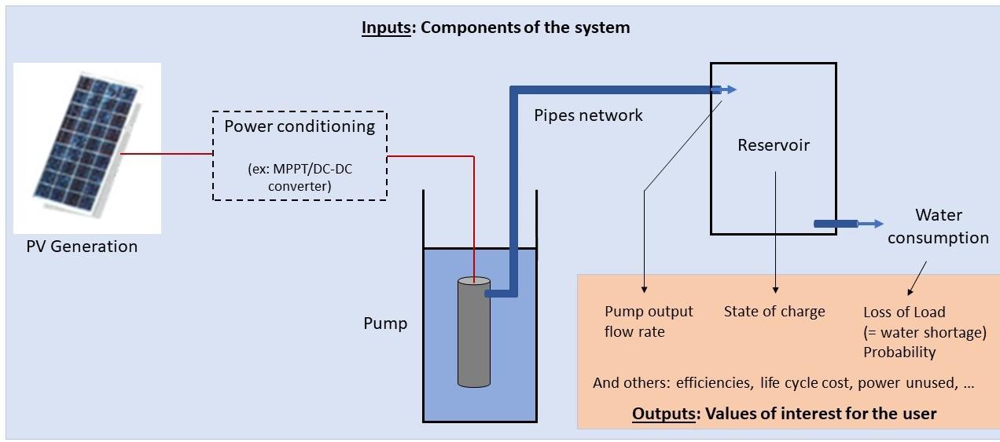
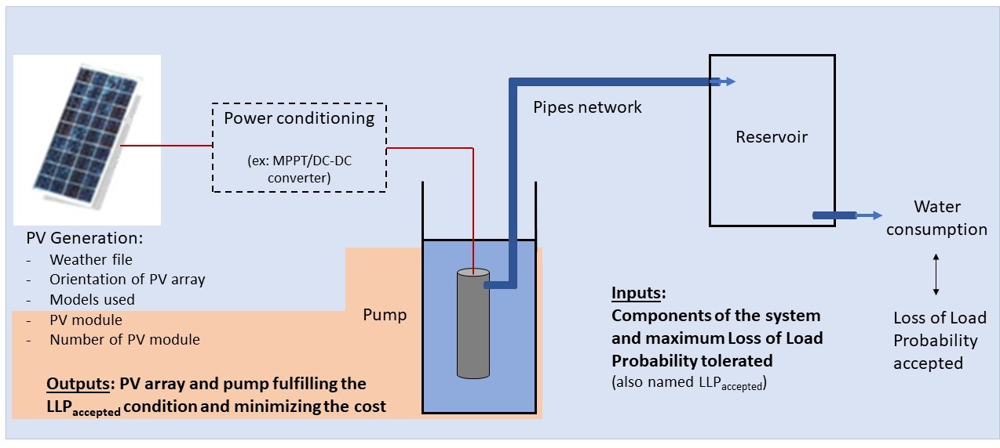

.. _package_overview:

Package Overview
================

Introduction
------------

Scope
^^^^^
*Pvpumpingsystem* is an open source package providing various tools aimed
at facilitating the modeling and sizing of photovoltaic powered water
pumping systems.

This package helps users to model, test and validate different photovoltaic
pumping systems before actually installing it in situ. In order to guide the
designer in her/his choice, *pvpumpingsystem* provides both technical and
financial information on the system. Even though the package is originally
targeted at researchers and engineers, three practical examples are provided
in order to help anyone to use pvpumpingsystem

It models pumping systems minimally made of PV generator, DC motor-pump and
pipes. Each component can be precisely defined by the user in such a way
it corresponds closely to any actual system wanted.
User can choose to add a MPPT/DC-DC converter to increase the energy
yield of the PV array or to directly couple PV array and motor-pump.
The software also allows to add water tank to mitigate the effect of
intermittency.

.. image:: ../images/schema_pvps.jpg
  :width: 700
  :alt: Basic schema of a PV pumping system

The simulation eventually compute numerous outputs like hourly flow rates of
a given pump, efficiencies of components, risk of water shortage and
life cycle cost of the whole system.

*Pvpumpingsystem* also offers to automate the process of sizing. In this case,
the user can provide a set of PV module, a set of motor-pumps and a
water needs file, and the software looks for the cheapest assembly while
making sure that it respects a minimum risk of water shortage.

Nevertheless, the number of sizing processes can be infinite, and this module
is expected to significantly expand with time, welcoming new sizing process
based on different selection criteria or algorithms. In particular,
the reservoir size, the orientation of the PV array, the coupling strategy
or even the diameter of pipes are inputs that could ultimately become outputs of
the sizing process as well.

To better understand the possibilities of *pvpumpingsystem* and how it works,
you are invited to consult the examples available in the form of
Jupyter Notebook in :ref:`examples` or the corresponding python files in
``docs/examples``.

Code characteristics
^^^^^^^^^^^^^^^^^^^^

Python is the programming language used in the software, and the code is
structured within an object-oriented approach. Continuous integration
services allow checking for lint in the code and to automatize the tests.
Each class and function are documented in the docstring with reference to the
literature when applicable.

In *pvpumpingsystem*, in order to increase the understandability of the code,
the physical components of the PV pumping system corresponds to a class
when possible, like for example the classes Pump(), MPPT(), PipeNetwork(),
Reservoir() and PVGeneration().
Moreover, each of these classes are gathered into separate modules with
appropriate names (`pump.py`, `mppt.py`, etc).
The previous objects are then gathered in the class PVPumpSystem() which
allows running partial or comprehensive modeling of the pumping system.

A separate module `sizing.py` is dedicated to functions allowing to size these
systems. These functions are globally numerical methods, relying on numerous
simulations run according to an algorithm or to a factorial design.
`sizing.py` module can be expanded a lot as many strategies can be imagined to
size such a system.

Pvpumpingsystem relies on already existing packages for photovoltaic
and fluid mechanics modeling, namely *pvlib-python* and *fluids*.
*pvpumpingsystem*'s originality lies in the implementation of various
motor-pump models for finite power sources and in the coupling
of the distinct components models.

Pvpumpingsystem is released under a GPL-v3 license.

Databases accessible
--------------------

The PV module database of the California Energy Commission (CEC) is made
accessible through PVGeneration (being itself a wrapper of pvlib-python).
As this database is nearly comprehensive (more than 22,000 modules)
and regularly updated, it was considered that having a function to
define its own PV module was not relevant yet. Therefore, PV modules must
be declared by giving the reference in the corresponding attribute in
declaration of any PVGeneration instance.

Furthermore, the package also provide some pump and weather files
in the folder ``pvpumpingsystem/data``.

Concerning pump files, a template is provided in the folder in order to help
anyone fill it in with the specification of the pump they want to model.
A limited database coming from the company SunPumps is also accessible.
Nevertheless, it does not mean that the developers particularly encourage
their use, it rather reflects the difficulty to find other sources easily
accessible online. Any addition to the database is warmly welcomed here.

The weather files consist in a very restricted list of .epw files coming from
diverse climates and that users can exploit to learn and test the software.
Similar files for many location around the world are available at
`EnergyPlus website <https://energyplus.net/weather>`_, or can be constructed
using `PVGIS <https://re.jrc.ec.europa.eu/pvg_tools/en/#MR>`_.

Getting support and contribute
------------------------------

If you need help, you think you have discovered a bug, or if you would
like to edit *pvpumpingsystem*, then do not hesitate to open an issue on our
`GitHub issues page <https://github.com/tylunel/pvpumpingsystem/issues>`_
or on our
`GitHub pull request page <https://github.com/tylunel/pvpumpingsystem/pulls>`_.

Credits
-------
The T3E research group would like to acknowledge Mr. Michel Trottier for
his generous support, as well as the NSERC and the FRQNT for their grants
and subsidies. We also acknowledges the contributions and fruitful discussions
with Louis Lamarche and Sergio Gualteros that inspired and helped with the
current work.

